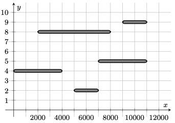
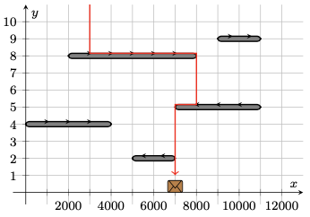
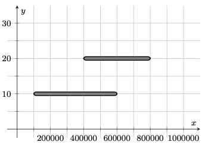

# Conveyor Chaos

A distribution center moves packages around using a system of conveyor belts, which can be represented as line segments on the 2D Cartesian plane. The $i$-th conveyor belt runs from coordinates $(A_i, H_i)$ to $(B_i, H_i)$. No two conveyor belts share any points in common, including endpoints or interior points. Gravity points in the direction of the negative y-axis, meaning that objects normally fall vertically downwards, with their y-coordinate decreasing over time.

Each conveyor belt runs to either the left or the right. A package can be considered to occupy a single point on the plane. If a package lands strictly within conveyor belt $i$ (excluding its endpoints), then it will be transported to its left or right end (either $(A_i, H_i)$ to $(B_i, H_i)$), depending on the conveyor belt's direction, before continuing to fall vertically downwards.

You'll start by selecting a single conveyor belt and choosing a fixed direction (either left or right) for it to run in. Then, random directions will be independently chosen for each of the remaining $N-1$ conveyor belts (each being either left or right with equal probability). Finally, a single package will be dropped into the system from high above, at coordinates $(x,1000000)$, where $x$ is a real value drawn uniform randomly from the inclusive interval 
$[0,1000000]$. Your objective is to minimize the expected horizontal distance which this package will travel along conveyor belts before hitting the ground (any point with y-coordinate $0$).

For example, consider the following system of conveyor belts (as are present in the second sample case):

Consider picking the conveyor belt at y-coordinate $5$ and causing it to run to the left. If it then so happens that the bottommost conveyor belt also runs to the left while the other three run to the right and the package falls at x-coordinate $3000$, then the package will travel a total of $6000$ units horizontally across conveyor belts, as illustrated below:

Determine the minimum achievable expected horizontal distance traveled by the package assuming an ideal initial choice of conveyor belt and direction.

Note: Your return value must have an absolute or relative error of at most $10^{-6}$ to be considered correct.

## Constraints
$1 \leq N \leq 500,000$\
$1 \leq H_i \leq 999,999$\
$1 \leq A_i < B_i \leq N$

## Example
$N = 2$\
$H = [10, 20]$\
$A = [100000, 400000]$\
$B = [600000, 800000]$

You should pick the second conveyor belt and cause it to run to the right. Packages falling at x-coordinates in the intervals $[0,100000]$ and 
$[800000,1000000]$ will fall directly to the ground (with $0$ horizontal travel distance), while packages falling at x-coordinates in the interval $(400000,800000)$ will have an average horizontal travel distance of $200000$ units. This leaves packages falling at x-coordinates in the interval $(100000,400000]$, which will have an average horizontal travel distance of either $150000$ units (if the first conveyor belt runs to the left) or $350000$ units (if it runs to the right). This yields an overall expected horizontal travel distance of $0\cdot 0.3+200000\cdot 0.4+((150000+350000)/2)\cdot 0.3=155000$, which is the minimum achievable expected horizontal travel distance.

## Solution

  
Spoiler

  ...

