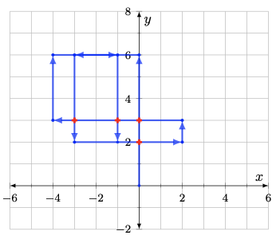

# Mathematical Art

You are creating a special painting on a canvas which may be represented as a 2D Cartesian plane. You start by placing a thin brush at the origin $(0,0)$ and then make $N$ axis-aligned strokes without lifting the brush off of the canvas. For the $i$-th stroke, you'll move your brush $L_i$ units from its current position in a direction indicated by the character $D_i$, which is either U (up), D (down), L (left), or R (right), while leaving behind a line segment of paint between the brush's current and new positions. For example, if $L_1=5$ and $D_1=L$, you'll draw a stroke between coordinates $(0,0)$ and $(-1,0)$, with your brush ending up at coordinates $(-5,0)$. Note that each stroke is either horizontal or vertical, and that each stroke (after the first) begins where the previous stroke ended.

This painting is being marketed as a work of mathematical art, and its value is based on the number of times a certain mathematical symbol appears in it - specifically, the plus sign. A plus sign is considered to be present at a certain position if and only if, for each of the 4 cardinal directions (up, down, left, and right), there's paint leading from the point in that direction (or, vice versa, leading to that point from that direction). Note that the paint from arbitrarily many strokes of your brush might come together to form any given plus sign, and that at most one plus sign may be considered to exist at any given position.

Determine the number of positions in the painting at which a plus sign is present.

## Constraints
$2 \leq N \leq 2,000,000$\
$1 \leq L_i \leq 1,000,000,000$\
$D_i \in \{\textrm{U},\textrm{D},\textrm{L},\textrm{R}\}$

## Example

$N = 9$\
$L = [6, 3, 4, 5, 1, 6, 3, 3, 4]$\
$D = \textrm{ULDRULURD}$

Expected Return Value: $4$

## Solution

  
Spoiler

  ...

